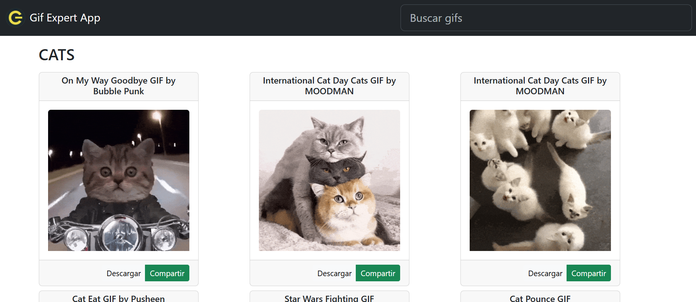

# Gif Expert App

Aplicación desarrollada en **React** como parte del curso _"React: De cero a experto (Hooks y MERN)"_ de **Fernando Herrera**. Esta aplicación permite buscar y mostrar GIFs animados utilizando la API de [Giphy](https://developers.giphy.com/).

---

## Tecnologías utilizadas

- **React**
- **Vite**
- **Bootstrap**
- **ESLint**

---   

## Aplicación

Puedes acceder a la aplicación desplegada aquí: [Gif Expert App](https://gif-expert-app-lake.vercel.app/)

---

## Autor

Desarrollado por: Fernando Hidalgo Rosabal.

---

## Licencia

Este proyecto está licenciado bajo la [Licencia MIT](https://opensource.org/licenses/MIT).

---